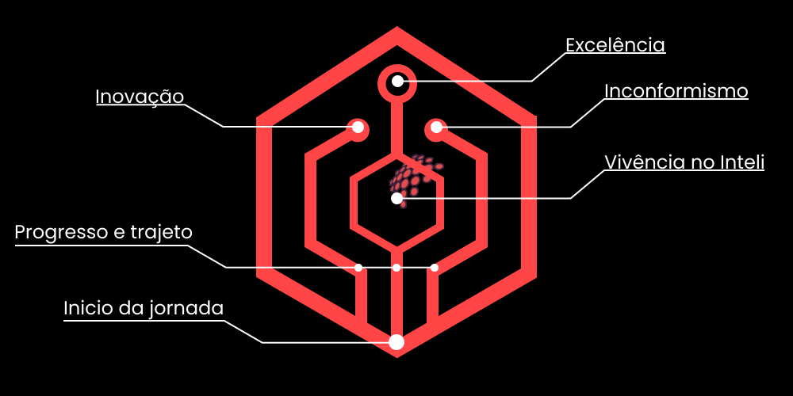
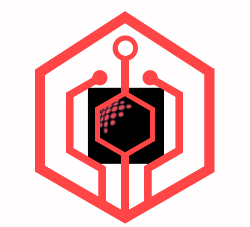
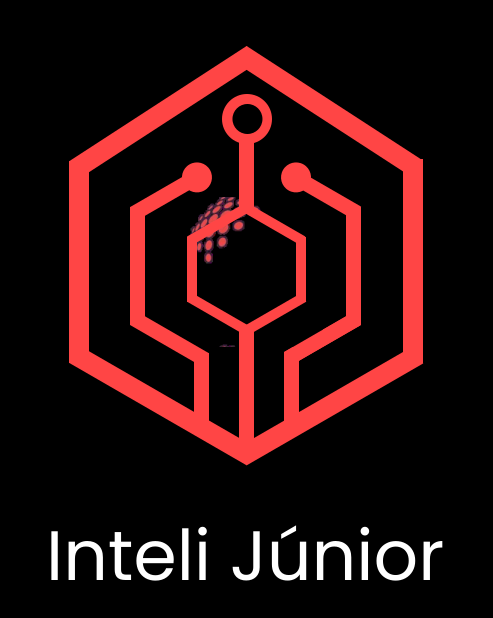
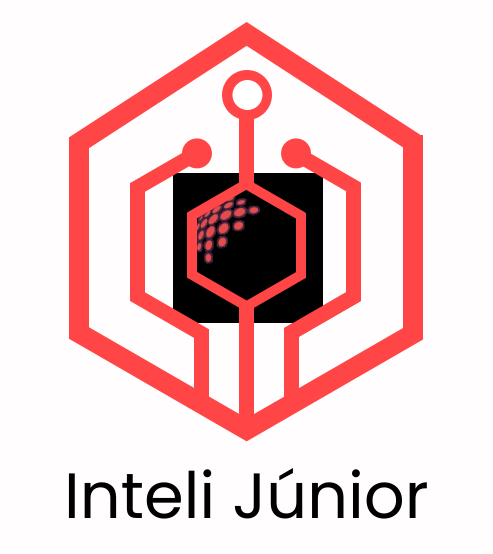
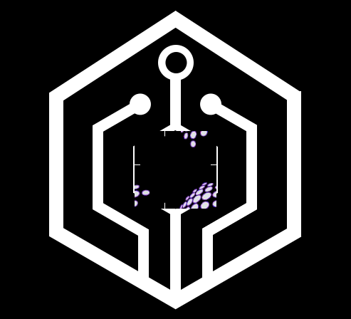
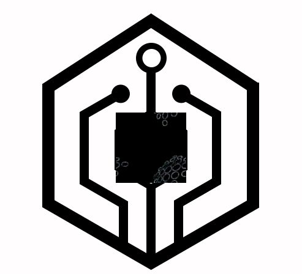
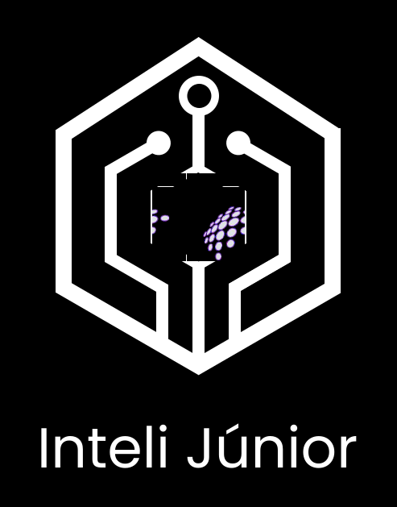
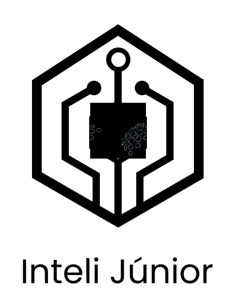
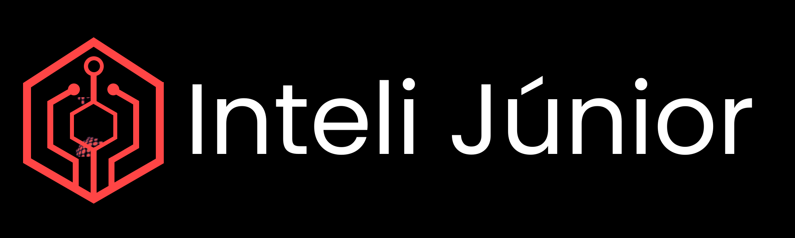
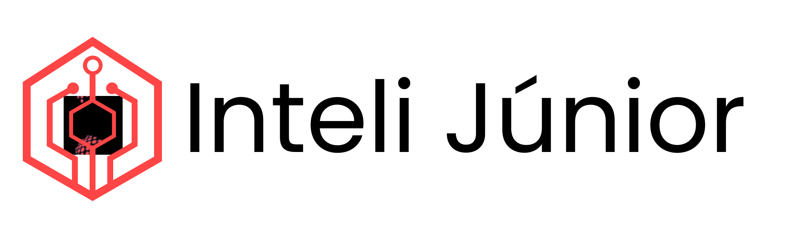

  
Figura 01 - Banner do autor

Autor: André Eduardo Lobo de Paula - Candidato a Inteli Junior

&nbsp;&nbsp;&nbsp;&nbsp;Este repositório se destina à resolução do case do time de marketing da Inteli Júnior, como parte da etapa final do processo seletivo (imersão).

## 1. O *case*

&nbsp;&nbsp;&nbsp;&nbsp;O *case* é sobre reformular o logotipo atual da Inteli Júnior. Recebemos a liberdade para realizar alterações no design do logo, somente com as instruções de manter a cor vermelha característica e o formato hexagonal, a fim de preservar a identidade visual da empresa, já amplamente reconhecida. Nosso objetivo principal era melhorar a harmonia e a simplicidade do logo, mantendo esses elementos essenciais para não provocar uma mudança visual muito brusca, descaracterizando a identidade visual da empresa.

## 2. identificando pontos de melhoria no logo atual

&nbsp;&nbsp;&nbsp;&nbsp;O logo atual apresenta uma série de características que o tornam visualmente complexo e desarmonioso. Vamos discorrer sobre esses pontos abaixo.

1. **Complexidade do design**: O logotipo atual tem muitas conexões e pontos (bolinhas) dentro do hexágono, o que cria uma complexidade desnecessária. Segundo [*Steve Krug*](#referencia-krug-2014) em *Don’t Make Me Think*, a complexidade visual prejudica a usabilidade, e no caso de logotipos, também a escalabilidade, especialmente em tamanhos menores.

2. **Competição visual**: O logo do Inteli Júnior compete visualmente com o logotipo do Inteli. [*David Airey*](#referencia-airey-2015) em *Logo Design Love* sugere que múltiplos elementos competindo entre si enfraquecem a identidade individual da marca, a tornando menos reconhecível.

3. **Peso da tipografia**: Os diferentes pesos de fonte usados em "Inteli JÚNIOR" são desequilibrados, o que contribui para a falta de harmonia entre o logotipo e o texto. *Alex W. White* em [*The Elements of Graphic Design*](#referencia-white-2011) explica que fontes desequilibradas criam dissonância visual, dificultando a integração do texto ao design como um todo.

## 3. desenvolvimento do novo logo

&nbsp;&nbsp;&nbsp;&nbsp;Com base nos pontos mencionados na [seção 2](#2-identificando-pontos-de-melhoria-no-logo-atual) desta documentação, decidimos utilizar o <a href="https://www.figma.com" target="_blank">Figma</a> como ferramenta para o desenvolvimento do novo logotipo. O Figma foi escolhido por sua robustez para a criação de designs, além da organização dos mesmos, o que nos permitiu desenvolver o design de forma eficiente.

&nbsp;&nbsp;&nbsp;&nbsp;Nosso principal objetivo era harmonizar melhor o logotipo da Inteli Júnior com o do Inteli, minimizando a complexidade do design original. Seguindo as práticas recomendadas por *Steve Krug* e *David Airey* sobre usabilidade e identidade visual, removemos várias das conexões e bolinhas presentes no hexágono e, ao mesmo tempo, buscamos simplificar a tipografia, a tornando mais equilibrada e integrada ao logotipo.

&nbsp;&nbsp;&nbsp;&nbsp;Além disso, queríamos que o logo refletisse não apenas uma sensação de tecnologia e modernidade, mas também uma integração mais harmônica com o logotipo do Inteli, reforçando a conexão entre a Inteli Júnior e sua matriz. Inspirados em conceitos de tecnologia e inovação, optamos por um design que lembrasse um circuito, representando a evolução dos membros ao longo de sua jornada no Inteli Júnior. O logo também destaca os três principais valores da organização: inovação, inconformismo e excelência, sintetizando a trajetória dos membros que, ao passarem pelo ambiente e metodologia do Inteli, desenvolvem habilidades e atingem grandes resultados.

&nbsp;&nbsp;&nbsp;&nbsp;Abaixo, apresentamos a proposta de reformulação do logotipo da Inteli Júnior.

  
Figura 02 - Proposta de reformulação do logotipo da Inteli Júnior 

Autor: André Eduardo Lobo de Paula - Candidato a Inteli Junior

&nbsp;&nbsp;&nbsp;&nbsp;Aqui está uma análise da proposta de reformulação do logotipo, indicando os principais pontos que queríamos representar.

  
Figura 03 - Análise dos principais elementos do logotipo reformulado

Autor: André Eduardo Lobo de Paula - Candidato a Inteli Junior

&nbsp;&nbsp;&nbsp;&nbsp;Apresentamos abaixo as diferentes variações do logotipo, sendo elas, nesta ordem: em fundo branco, fundo preto com o nome abaixo do logo, fundo branco com o texto abaixo, monocromático negativo, monocromático positivo, monocromático negativo com o nome abaixo, monocromático positivo com o nome abaixo, fundo preto com o nome à direita e fundo branco com o nome à direita.

Figura 04 - Logotipo em fundo branco 

Autor: André Eduardo Lobo de Paula - Candidato a Inteli Junior

Figura 05 - Logotipo em fundo preto com o nome abaixo

Autor: André Eduardo Lobo de Paula - Candidato a Inteli Junior

Figura 06 - Logotipo em fundo branco com o nome abaixo

Autor: André Eduardo Lobo de Paula - Candidato a Inteli Junior

Figura 07 - Logotipo monocromático negativo 

Autor: André Eduardo Lobo de Paula - Candidato a Inteli Junior

Figura 08 - Logotipo monocromático positivo 

Autor: André Eduardo Lobo de Paula - Candidato a Inteli Junior

Figura 09 - Logotipo monocromático negativo com o nome abaixo

Autor: André Eduardo Lobo de Paula - Candidato a Inteli Junior

Figura 10 - Logotipo monocromático positivo com o nome abaixo

Autor: André Eduardo Lobo de Paula - Candidato a Inteli Junior

Figura 11 - Logotipo em fundo preto com o nome à direita

Autor: André Eduardo Lobo de Paula - Candidato a Inteli Junior

Figura 12 - Logotipo em fundo branco com o nome à direita

Autor: André Eduardo Lobo de Paula - Candidato a Inteli Junior

&nbsp;&nbsp;&nbsp;&nbsp;A versão em Figma pode ser acessada <a href="https://www.figma.com/design/3LTvxaDB3UQL7k4pBnGrCm/Untitled?node-id=0-1&t=I3gc9glwXL9aL1TO-1" target="_blank">clicando aqui</a>. Ela inclui as versões do logo em fundo transparentes Sinta-se à vontade para alterar e testar suas ideias na proposta de logo. Recomendamos criar uma cópia sua para alterações, mas não se preocupe, temos uma cópia de segurança! Então, edite o logo como quiser.

## 3. conceito do novo logo

&nbsp;&nbsp;&nbsp;&nbsp;O design do novo logotipo foi pensado para representar o trajeto dos membros da Inteli Júnior dentro da organização. Os membros partem da parte inferior do hexágono, simbolizando o início de sua jornada. Ao passar pela metodologia e pela vivência no Inteli, representada pelo hexágono e suas linhas, eles percorrem o caminho que leva até os três pontos superiores.

&nbsp;&nbsp;&nbsp;&nbsp;Esses três pontos simbolizam os três principais valores da Inteli Júnior. O ponto à esquerda representa o valor da inovação. O ponto à direita simboliza o inconformismo, e a junção desses valores, juntamente com o ambiente e a metodologia do Inteli, resulta no terceiro ponto, que representa a excelência dos membros e dos projetos desenvolvidos dentro da Inteli Júnior.

&nbsp;&nbsp;&nbsp;&nbsp;Apesar desse conceito, o logotipo pode ter diferentes interpretações. Assim como qualquer forma de arte, ele está aberto à subjetividade, e cada pessoa pode encontrar nele significados únicos e pessoais.

### 4. Diferenças entre o logo atual e o novo:

- **Redução da complexidade**: O novo logotipo simplifica as conexões e pontos (bolinhas), criando uma aparência mais limpa e fácil de memorizar, seguindo os princípios de [*Rudolf Arnheim*](#referencia-arnheim-1974) em *Gestalt Psychology in Design*, onde simplicidade visual facilita a memorização e compreensão rápida.

- **Harmonia entre os logos**: Ao integrar melhor os logos do Inteli e do Inteli Júnior, conseguimos criar um design que respeita a regra do Inteli e a identidade visual da empresa enquanto promove a marca Júnior.

- **Circuito e tecnologia**: O novo design lembra um circuito eletrônico, simbolizando a conexão e os processos de inovação que são centrais para a identidade da Inteli Júnior.

## 5. pontos de melhoria

&nbsp;&nbsp;&nbsp;&nbsp;No futuro, caso haja interesse, seria importante revisar alguns aspectos para aprimorar ainda mais sua aplicação:

- **Simetria dos vértices**: Alguns vértices do hexágono podem não estar completamente simétricos. Ajustes finos nesse sentido podem ajudar a criar um logo visualmente mais equilibrado.

- **Versões em gradiente**: Criar versões do logotipo em gradiente pode ser uma boa opção, seguindo o guia de estilo da empresa, para se adequar a diferentes contextos e materiais de comunicação

- **Ajuste das proporções**: Revisar o tamanho das formas geométricas e dos elementos internos pode ajudar a garantir que o logo funcione em todas as plataformas e tamanhos.

- **Tipografia**: Para as versões com o texto "Inteli Júnior", recomendamos a utilização da fonte *Jano Round Light*, por ser a fonte utilizada pelo Inteli no seu logotipo e pelo inteli junior em alguns casos.

## 6. conclusão

&nbsp;&nbsp;&nbsp;&nbsp;O processo de desenvolvimento do novo logotipo para a Inteli Júnior buscou alinhar a identidade visual da marca com valores de inovação, progresso e excelência. Utilizando uma abordagem minimalista, o novo design foca na simplicidade, escalabilidade e harmonia visual entre os logotipos da Inteli Júnior e do Inteli.

&nbsp;&nbsp;&nbsp;&nbsp;A sensação de crescimento e progressão é refletida nas formas geométricas e no movimento sugerido pelo design. O ponto focal do logotipo é claro, atraindo a atenção para o centro, enquanto as linhas conectadas evocam um circuito que simboliza a interconectividade e os processos inovadores da Inteli Júnior.

&nbsp;&nbsp;&nbsp;&nbsp;Com esses ajustes e considerações futuras, acreditamos que o novo logotipo tem uma forte presença e representa de forma clara e moderna os valores e a missão da Inteli Júnior.

## 7. Referências:

[1] KRUG, Steve. *Don't Make Me Think: A Common Sense Approach to Web Usability*. 3rd ed. New Riders, 2014. Disponível em: <https://www.amazon.com/Dont-Make-Think-Revisited-Usability/dp/0321965515>. Acesso em: 13 set. 2024.

[2] AIREY, David. *Logo Design Love: A Guide to Creating Iconic Brand Identities*. 2nd ed. New Riders, 2015. Disponível em: <https://www.amazon.com/Logo-Design-Love-Creating-Identities/dp/0321985206>. Acesso em: 14 set. 2024.

[3] ARNHEIM, Rudolf. *Gestalt Psychology in Design: The Formative Years of an Art*. Berkeley: University of California Press, 1974. Disponível em: <https://www.ucpress.edu/book/9780520266007>. Acesso em: 14 set. 2024.

[4] WHITE, Alex W. *The Elements of Graphic Design*. 2nd ed. Allworth Press, 2011. Disponível em: <https://www.amazon.com/Elements-Graphic-Design-Alex-White/dp/1581157627>. Acesso em: 15 set. 2024.
